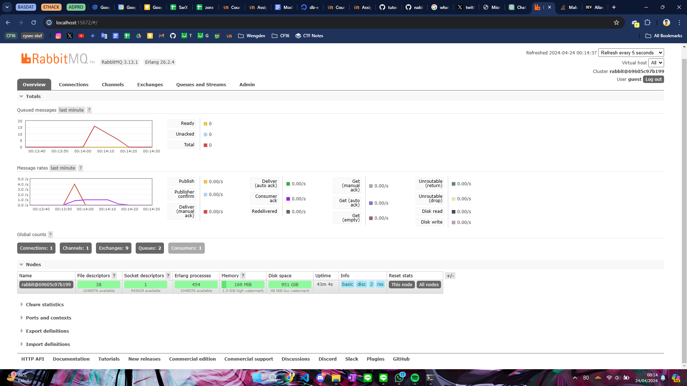

# Tutorial 8 Reflection Notes

### Subscriber questions
a. What is amqp?

AMQP atau Advanced Message Queueing Protocol adalah protokol layer aplikasi yang digunakan untuk pertukaran pesan antara aplikasi atau sistem. AMQP memungkinkan sistem yang berbeda untuk berkomunikasi satu sama lain dengan lebih _reliable_, lebih _secure_, dan secara asinkronus. AMQP seringkali dipakai pada sistem terdistribusi, _environment_ komputasi awan, dan implementasi middleware berorientasi pesan. AMQP menyediakan fitur seperti antrian pesan, routing, reliability, dan security, sehingga menjadi pilihan yang cukup sering digunakan untuk membangun sistem messaging yang lebih scalable dan kokoh.

b. On `guest:guest@localhost:5672`, what is the first `quest`, second `quest`, and `localhost:5672` for?

String tersebut adalah URI yang digunakan untuk menghubungkan aplikasi ke RabbitMQ menggunakan protokol AMQP. `guest` yang pertama adalah username pengguna yang digunakan untuk autentikasi, `guest` kedua adalah kata sandi dari username tersebut, dan `localhost:5672` adalah host dan port dari server RabbitMQ yang ingin diakses secara local.

### Foto Spike pada Queued Messages

Dalam screenshot saya, terdapat 16 queued messages. Menurut perkiraan saya, hal ini terjadi karena saya menjalankan kode publisher sebanyak 4 kali, jadi ada 4*5 = 20 messages. 4 message pertama masih bisa diproses oleh subscriber secara langsung, tetapi sisa 16 nya harus dimasukkan ke antrian karena terdapat bagian kode pada subscriber yang melakukan sleep pada thread sehingga setiap proses harus menunggu sleep selesai terlebih dahulu sebelum dijalankan. Karena message menumpuk, maka message disimpan sebagai queue terlebih dahulu sambil menunggu subscriber bisa memproses messagenya.
